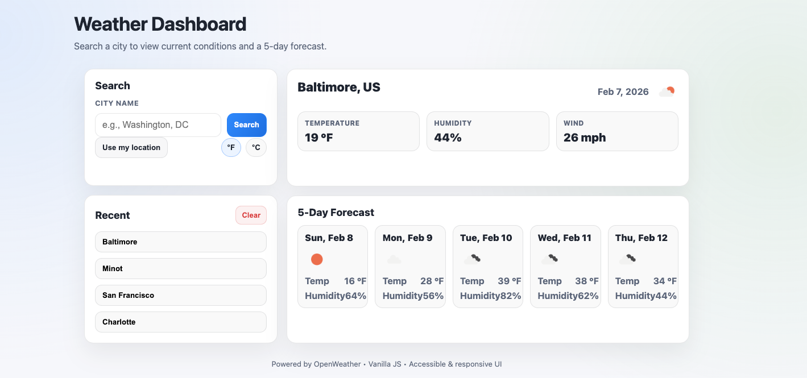

# Weather Dashboard

**Live Application:**  
https://rbenney15.github.io/weather-dashboard/

---

## Preview

---

## Overview

Weather Dashboard is a responsive, accessible web application that provides current weather conditions and a 5-day forecast for any searched city. The project was refreshed to remove framework dependencies and improve both code quality and user experience.

Search history is saved locally so previously searched cities can be revisited quickly.

---

## Key Features

✅ Current weather (temperature, humidity, wind)  
✅ 5-day forecast with daily cards  
✅ Recent searches with deduping + local persistence  
✅ Unit toggle (°F / °C)  
✅ “Use my location” search (geolocation + reverse lookup)  
✅ Clean, responsive UI without Bootstrap  
✅ Accessible UI with focus states and semantic structure  

---

## Technical Highlights

- Vanilla JavaScript (ES6+) with reusable rendering functions
- Native date formatting (no Moment.js)
- Fetch-based API utilities with error handling
- LocalStorage persistence for search history
- Modern CSS with variables and responsive grid layout

---

## Built With

- **HTML5**
- **CSS3**
- **Vanilla JavaScript**
- **OpenWeather API**

---

## Project Links

- Live: https://rbenney15.github.io/weather-dashboard/
- Repo: https://github.com/Rbenney15/weather-dashboard

---
